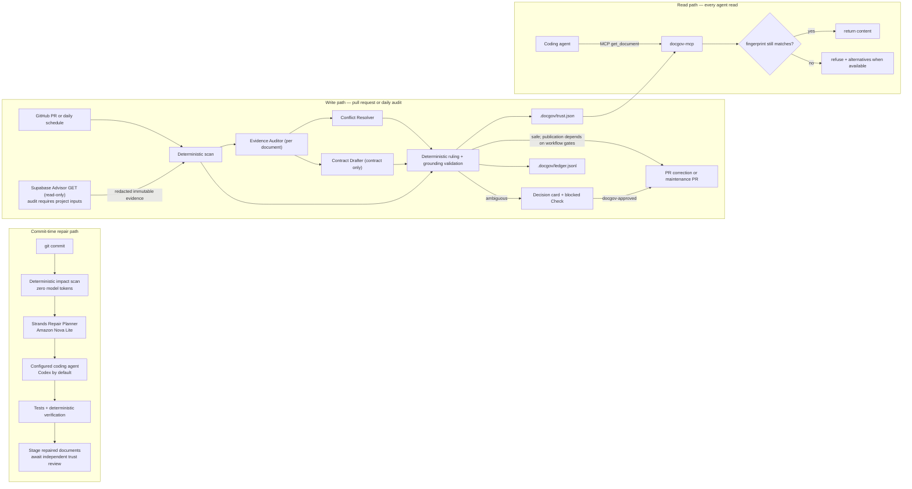

# Doc Governor

**Doc Governor is the layer that decides which documents an AI coding agent is allowed to believe.**

It reduces the risk of AI-generated documentation becoming false memory. A coding agent asks for `docs/architecture/API.md` over MCP; Doc Governor checks stored usability and current hashes, refusing access when those checks fail and offering source pointers when available. These checks do not prove prose true. Strict verification also has an intentional bootstrap exception for registered Catalog control documents, described below.

## Why it exists

A small team ships with AI coding agents. Those agents read the repository's Markdown as ground truth. When a document silently goes out of date, the agent does not notice — it confidently builds on a false statement, and nobody catches it until production. The person harmed is the engineer who trusted the output.

The read gate withholds documents that fail its implemented trust checks, including documents already merged into `main`. This boundary applies to reads through Doc Governor; it does not prevent an agent with filesystem access from reading Markdown directly.

Coding agents are also excellent at producing text and poor at maintaining a small set of authoritative documents. A repository slowly accumulates duplicate API notes, stale status pages, and dates that were changed without evidence. Doc Governor treats documentation as a governed system with five types:

| Type | Lifecycle |
| --- | --- |
| `contract` | Update the canonical document when its source dependency changes. |
| `state` | TTL is checked during trust analysis; registered bootstrap controls are exempt. |
| `procedure` | Requires review when commands or operational dependencies change. |
| `evidence` | Intended as an immutable, dated record; evidence edits are flagged for review. |
| `decision` | Superseded by a newer decision instead of silently deleted. |

For same-repository PRs with apply enabled, the action attempts a correction commit for safe changes, even when a separate high-risk finding still blocks the pull request. It blocks ambiguous, destructive, legal, public-copy, and unsupported-state changes and attempts to publish a decision card in the pull request. A maintainer adds the `docgov-approved` label to authorize a one-time rerun for the current commit.

The model is reserved for semantic classification and ambiguity. Hashes, dependency matching, TTL checks, path boundaries, trust decisions, Supabase Advisor evidence, and ledger writes are deterministic and can run without AWS.

## The three enforcement points

```
BEFORE COMMIT                 ON THE PULL REQUEST             AT EVERY AGENT READ
─────────────                 ───────────────────             ───────────────────
Git paths + hashes            deterministic scan              MCP get_document
  │                              │                              │
  ▼                              ▼                              ▼
Strands Repair Planner        Strands governance graph        recompute dependency
(read-only, Nova Lite)        ├ Evidence Auditor              fingerprint NOW
  │                     ├ Conflict Resolver                     │
  ▼                     └ Contract Drafter                ┌─────┴─────┐
Codex edits the document               │                     MATCH       MISMATCH
  │                              ▼                       │             │
  ▼                     deterministic ruling             ▼             ▼
tests + stage repair          + trust table + ledger       return       refuse +
  │                                                    content      pointers if available
  ▼
independent trust review required
```

Applying PR review, daily audit, or source reconciliation can regenerate `.docgov/trust.json` locally. Publication depends on the workflow: maintenance-PR steps require a successful action with changes, and the daily workflow does not publish drift-only changes when its earlier audit reports no changes. The read path checks stored usability and rechecks document and dependency hashes — it never calls a model and never touches the network. For entries carrying a `codex:` verifier, it also rechecks the scoped coding-agent receipt and current policy as described below. It does not recompute TTL expiry between trust-table regenerations.

### Commit-triggered source reconciliation

Copy `.github/workflows/docgov-source-reconcile.yml` to reconcile generated Supabase inventory after a commit reaches `main`. It triggers only when a declared `**/supabase/config.toml` or `**/supabase/functions/**` path changes, runs the deterministic engine with the model disabled, and opens or updates one `docgov/source-reconcile` maintenance pull request when safe changes exist and the action succeeds. If the result is `action_required` or `blocked`, `action.yml` exits unsuccessfully and the subsequent maintenance-PR step is skipped, even if safe changes were made locally.

The reconciler derives Edge Function names and JWT flags from the checked-out commit's configuration and function source. When configured and source function inventories match and are nonempty, it can update eligible `docgov:supabase-inventory` markers, including after a revert that leaves functions present. If reverting the addition of the final function leaves both inventories empty, `engine.analyze` skips marker reconciliation entirely, including other inventory fields, so the earlier marker is not automatically restored. Only supported fields already present in a marker are reconciled. It stages only paths in Doc Governor's `modified_paths` result, including the ledger and trust table when they change.

This reconciles source facts, not environment claims: a Git commit does not assert what is deployed to staging or production. Source/config mismatches block reconciliation; protected or ambiguous marker updates cannot be applied automatically. Missing markers are not created, and ordinary Markdown prose is not rewritten by this reconciler. Skipped reconciliation does not itself guarantee a blocked or stale verdict; other governance checks determine whether review is required.

### Coding-agent repair before commit

The shared `docgov repair --json` entry point repairs eligible documents before a commit. The tracked `.githooks/pre-commit` hook delegates to this command. Only staged changes to declared dependencies trigger the planner; unstaged source edits remain outside its snapshot. Protected documents and documents requiring human approval are never automatic repair targets.

The read-only Strands Repair Planner on Amazon Bedrock receives each target and its changed declared sources. A missing, malformed, out-of-scope, or `needs_human` plan blocks execution. Codex is the default executor; `DOCGOV_REPAIR_COMMAND` may select another trusted local command accepting the plan on stdin. Commands come from local configuration, never from model output.

The executor runs in a temporary Git repository containing HEAD plus the exact staged patch. The publication checks permit changes only to existing allowlisted document files. Verification must pass before repaired bytes return to the original worktree and index. Partially staged target documents, concurrent source edits, changes outside the allowlist, HEAD/index-tree changes, and edits detected by the metadata guard stop publication. Unrelated local work is preserved. A repeated repair with no new document difference stages nothing extra. The executor and verifier are trusted local commands; the temporary repository and publication checks are not an operating-system sandbox.

The metadata guard in `repair_executor._metadata` strips asterisks and backticks, then compares the ordered matches of a case-insensitive, multiline regex. It recognizes `狀態`, `最後驗證`, `最後更新`, `status`, `approval`, `last_verified_at`, and `last verified` at the start of a line after optional whitespace and an optional table-opening `|`, followed by optional whitespace and `:`, `：`, `=`, or `|`. Thus it covers these key-value lines and Markdown table rows whose first cell is a recognized label. Changes to the normalized matched lines block publication with `verification_metadata_modified`. `test_table_verification_date_cannot_be_refreshed` adds regression coverage for a bold `last_verified_at` table row and checks that publication leaves the original worktree and index unchanged. This is syntactic protection: other labels, layouts, or verification claims embedded in ordinary prose can escape it.

```sh
python -m pip install '.[bedrock]'
aws login --profile docgov-local --region us-west-2
export AWS_PROFILE=docgov-local
export AWS_REGION=us-west-2
export AWS_DEFAULT_REGION=us-west-2
export AWS_EC2_METADATA_DISABLED=true
export DOCGOV_ENABLE_MODEL=1
export DOCGOV_VERIFY_COMMAND='python -m unittest discover -v'
git config core.hooksPath .githooks

docgov repair --json
# The same operation also runs before git commit.
```

Use a restricted AWS identity with only the model invocation and short-lived sign-in permissions. The Bedrock extra includes `botocore[crt]`, which the AWS login credential provider requires. Affected commits fail closed when model access or the explicit verification command is unavailable; unaffected commits require no model call. `repair-prompt` remains the provider-neutral planning interface, but the repair hook requires a real model-backed plan and provides no skip or substitute-planner switch.

JSON reports `result`, `model_requested`, `model_used`, identifier-only `model_trace`, `source_head`, `staged_tree`, target documents, `modified_paths`, verification, and a sanitized error code. Requested execution is distinct from successful model execution: empty graphs and failed calls do not report model success. A completed model may still yield a rejected plan, so `model_used: true` alone does not prove successful repair. Save the JSON together with the reviewed staged diff for acceptance evidence; public traces exclude private document text.

The repair coordinator records no approval or verification evidence and does not invoke `baseline --approved`. Catalog and ledger changes are outside its publication allowlist; verification dates in document prose are protected only when they match the metadata syntax above. Tests establish only what they check. Sophie has delegated final trust review for explicitly allowlisted contracts to an independently invoked coding-agent review. Repair success is not approval; documents outside that delegation retain their existing approval policy.

Example Catalog policy (the target must also have a registered contract or procedure record with declared dependencies):

```yaml
policies:
  auto_repair_documents:
    - docs/architecture/DATABASE.md
  protected:
    - docs/status/**
```

### Independent coding-agent trust review

After the prose is ready, invoke the separate review explicitly:

```sh
docgov coding-review PATH --verify-command COMMAND --json
# For example, when README.md is an owner-allowlisted contract:
PYTHONDONTWRITEBYTECODE=1 docgov coding-review README.md --verify-command 'python3 -m unittest discover -v' --json
```

The command accepts one or more explicit paths, requires a nonempty verification command, and uses the standard `.docgov` paths; custom Catalog, ledger, and trust-state options are rejected. `--timeout` defaults to 900 seconds. JSON reports the governance result, changed paths, and any blocking error.

The owner-controlled `.docgov/coding-agent-review-policy.json` authorizes the delegation. The implementation requires version `1`, reviewer `coding_agent`, status `authorized_review_pending` or `enabled`, and every requested path in its `documents` allowlist. The policy and targets must be tracked in the Git index. Authorization permits a review; it does not establish trust. Each target must be a registered `contract` with status `current` or `stale` and nonempty matching dependency evidence; a dependency matching `.docgov/catalog.yaml` is rejected. A matching review can satisfy the protected-change gate for that exact allowlisted contract, but does not widen the repair planner or executor's permissions. This is no approval of `procedure`, `state`, `evidence`, or `decision` documents, release readiness, or deployment.

`docgov/coding_review.py` copies the current working bytes of tracked files into an isolated repository, preserving the original prose and index. It rejects partial staging. The supplied repository verification command must pass without changing the isolated files. A separate `codex exec --sandbox read-only` session is instructed to review all material target claims against source, tests, and deployment evidence where relevant, returning a schema-constrained verdict. Passing tests alone do not establish prose truth. This independent review supplies the additional evidence check for claims that syntactic repair guards cannot assess. Its judgement is model-based: the coordinator checks the verdict, scope, citations, and snapshot integrity, but does not independently prove that each claim was inspected or follows from its citations. The coordinator verifies actual model-session execution from exactly one nonempty `thread.started` identity and a `turn.completed` event with positive output-token usage; a verdict file alone is insufficient.

The coordinator requires the exact snapshot and target set, a `trusted` verdict with no unresolved claims for every target, and nonempty evidence citations matching each target's declared dependencies. Citations cannot name a target, `.docgov` metadata, or a file outside the snapshot. It rechecks the isolated files, original working-file signatures, HEAD, and index tree before recording trust. Missing or invalid authorization, ineligible scope, failed verification or reviewer execution, malformed or unsupported verdicts, invalid citations, and concurrent source changes fail closed.

On success, the coordinator writes `.docgov/reviews/<snapshot_id>.json` with the Codex session identity, source HEAD, exact document SHA-256 hashes, dependency fingerprints, cited source-file SHA-256 hashes, and verification command/output hash. It appends hash-bound `verify_current` ledger evidence and may promote only the reviewed stale contracts to `current`, without refreshing verification dates. `cli.py` then regenerates the deterministic trust table. It does not stage or commit these changes or run `baseline --approved`. An already matching review returns `pass` without another model invocation. Trust-table generation failure reports a blocked result; it does not roll back evidence already written.

`engine.py` checks the current policy, latest verification entry, receipt hash, reviewer identity, document hash, and dependency fingerprint when validating a coding-agent review. In strict trust analysis, a revoked or mismatched review is untrusted for non-control documents; registered Catalog control documents take the bootstrap branch before this check. The MCP server remains read-only, with no write, shell, or network tool; it neither invokes this review nor grants approval, and its existing trust gate still controls document access. For a trust entry carrying a `codex:` verifier, `mcp_server.py` reloads the Catalog and calls `has_matching_coding_review` before allowing access, rechecking the current scoped receipt, ledger verification, and delegation policy without regenerating the trust table. Missing, invalid, or revoked proof refuses access. This additional check depends on the entry’s verifier field; older entries without it need trust-table regeneration to gain that check. TTL expiry is still evaluated during trust-table generation, not on each MCP read.

`tests/test_coding_review.py` uses a fake Codex executable to cover receipt recording, prose/index preservation, policy scope, rejected verdicts and citations, missing model completion, verifier failure or mutation, partial staging, source races, and invalidation after source changes. These tests do not establish live Codex acceptance or prove the reviewed prose correct. This owner-authorized README edit remains untrusted until independent review; no real acceptance is claimed here.

**Why the recheck matters.** If a declared dependency changes the fingerprint relative to the loaded trust table, the next MCP recheck refuses the document without another Doc Governor run. A new commit alone need not change that fingerprint. The read is not atomic: content is read again after the hash check, so concurrent edits can race with serving it. Bootstrap controls still undergo these MCP hash checks; their strict-verification exemption does not establish reviewed prose truth.

## Quick start

Requirements: Python 3.12+ and a GitHub repository. AWS credentials are required for the enabled Bedrock governance graph and repair planner. Strands supports Python 3.10+; the action uses Python 3.12 for a reproducible runtime. Install the `bedrock` extra to enable the PR governance graph and required-document Repair Planner.

1. Add `.docgov/catalog.yaml` to your repository. `docgov init` can generate a proposal.
2. Copy `.github/workflows/docgov-review.yml` from this repository. It checks out the PR head and executes `uses: ./`; `action.yml` installs and runs the Python package from that checkout. PR-controlled code therefore executes in the job. Workflow permissions request write and OIDC access; the supplied configuration enables apply, credential persistence, and the conditional AWS role exchange for same-repository PRs. Fork inputs disable apply and model use, but these settings are not an execution sandbox. The following standalone action example references a release instead of the supplied workflow’s local checkout:

```yaml
name: Doc Governor
on:
  pull_request:
    types: [opened, synchronize, reopened, labeled]
permissions:
  contents: write
  pull-requests: write
  checks: write
jobs:
  govern:
    runs-on: ubuntu-latest
    steps:
      - uses: SophieYu04/doc-governor@v0.3.0
        with:
          mode: review
          base_sha: ${{ github.event.pull_request.base.sha }}
          head_sha: ${{ github.event.pull_request.head.sha }}
          apply: ${{ github.event.pull_request.head.repo.full_name == github.repository }}
          approved: ${{ github.event.action == 'labeled' && github.event.label.name == 'docgov-approved' }}
          enable_model: true
        env:
          GITHUB_TOKEN: ${{ secrets.GITHUB_TOKEN }}
```

`enable_model` defaults to `false`, so installing the action cannot create model charges by itself. The competition profile sets it to `true` explicitly; the supplied workflow requests deterministic-only operation for forks, and offline runs use the deterministic path unless model use is explicitly enabled.

3. Read the repository's exact GitHub OIDC subject prefix with `gh api repos/OWNER/REPO/actions/oidc/customization/sub --jq .sub_claim_prefix`. In `infra/aws/github-oidc-trust-policy.json`, replace `<AWS_ACCOUNT_ID>` and `<GITHUB_SUB_CLAIM_PREFIX>` with the account ID and that complete prefix. This supports both name-based and immutable owner/repository-ID subjects; do not guess the subject from the repository name.
4. Create a least-privilege AWS role with that trust policy and `infra/aws/bedrock-inference-policy.json`, replacing its account ID too. Set the role ARN as the repository variable `DOCGOV_AWS_ROLE_ARN`, then set `DOCGOV_ENABLE_MODEL=true` only on the competition repository. The Bedrock policy permits only the Amazon Nova Lite US inference profile and its three documented destination-region foundation models. The workflow exchanges GitHub OIDC for short-lived credentials only on same-repository pull requests with both variables configured; for forks, that exchange is skipped and the action inputs request deterministic operation. This does not isolate execution of the PR checkout.
5. Run `docgov init` once and review the generated Catalog proposal.

The OIDC subject lookup follows [GitHub's AWS guidance](https://docs.github.com/en/actions/how-tos/secure-your-work/security-harden-deployments/oidc-in-aws), including immutable repository subjects for newer repositories. The destination-model grants follow [Amazon Bedrock's geographic cross-Region IAM requirements](https://docs.aws.amazon.com/bedrock/latest/userguide/geographic-cross-region-inference.html). Governor responses use the current [Strands structured-output invocation](https://strandsagents.com/docs/user-guide/concepts/agents/structured-output/) and fail closed on validation or timeout errors.

The supplied workflow disables Doc Governor mutations for forks and skips its AWS role exchange. It still executes the fork’s checkout, so “read-only” describes the intended governance mode, not a guarantee about that code’s behavior. Never use `pull_request_target` to execute untrusted pull request code or expose repository secrets.

The GitHub reporter attempts to upsert a Check and one decision-card comment when PR context and a token are available. Token permissions or API failures can prevent publication, including on forks. A successful approved run requests removal of `docgov-approved`; a new commit must be evaluated again.

## Connect your coding agent

`docgov-mcp` is a read-only MCP server over stdio. Configure Codex, Claude Code, or Cursor to use it for governed reads; configuring MCP does not disable those agents’ direct filesystem access.

```sh
python -m pip install 'doc-governor[mcp]'
docgov review --apply          # generates .docgov/trust.json
```

```json
{
  "mcpServers": {
    "docgov": {
      "command": "docgov-mcp",
      "args": ["--root", "/absolute/path/to/your/repo"]
    }
  }
}
```

Three tools, all read-only:

| Tool | Answer |
| --- | --- |
| `get_document(path)` | The content, or a refusal that says why and names alternatives when available. |
| `list_documents(type?, usable_only?)` | Usable documents by default (`usable_only=true`); pass `usable_only=false` to include refused documents, marked `usable: false` with the reason. |
| `document_status(path)` | For a known entry with an accepted path and loaded trust state, the trust record and live fingerprint check; otherwise `known: false` and a reason. Never returns content. |

For known entries with accepted paths and a loaded trust state, all three use the same usability recheck. Listings summarize only entries that pass it; these separate calls are not an atomic snapshot of a changing working tree.

A trusted read:

```json
{
  "status": "ok",
  "path": "docs/architecture/API.md",
  "content": "<full markdown>",
  "verified_at": "2026-09-06T02:10:00Z",
  "scope": "current_fact"
}
```

Refusals explain the reason and offer source pointers or a canonical document when available. `read_instead` may be empty and `canonical_path` may be null: missing-state, rejected-path, and unknown-document responses supply neither alternative (unknown documents use `status: "unknown"`). Even known entries may lack pointers. For example, a dependency-change refusal with available source pointers looks like this:

```json
{
  "status": "refused",
  "code": "dependencies_changed",
  "path": "docs/status/RELEASE.md",
  "content": null,
  "reason": "A declared dependency of this document changed after it was verified, so its claims are unverified.",
  "read_instead": ["supabase/config.toml", "supabase/functions/health-check/index.ts"],
  "canonical_path": null,
  "how_to_resolve": "A maintainer must re-verify this document and run `docgov baseline --approved`."
}
```

Call `list_documents(usable_only=false)` to discover unusable entries in the loaded trust table and their refusal reasons. The default listing hides them. If the trust state cannot be loaded, either listing returns an empty list; it does not enumerate unknown documents.

### MCP security properties

- The server exposes **no write, shell, or network tool**, and its read handlers make no network calls. It does not install a process-level network-egress restriction. It reads local files, including the trust table and, for delegated reviews, policy, receipt, and ledger evidence.
- It rejects absolute paths, `..` segments, Windows drive letters, URL schemes, NUL bytes, non-Markdown suffixes, and symlinks that resolve outside the repository root.
- Refusal responses set `content` to null and do not extract a document excerpt. Generated blocking reasons use fixed messages rather than model prose; stored reasons and paths are still returned from trusted local control data. This is not sanitization of an arbitrarily tampered trust table. `list_documents` summarizes only entries that pass its usability recheck.
- When `.docgov/trust.json` is missing or declares an unknown schema version, the server records a load error and refuses document reads; listings return no entries. This does not require server startup to abort, and it never falls back to serving everything.
- Content is read from disk at call time, never cached at startup, because the repository changes underneath a long-running server.

## Four constrained roles across two Strands workflows

The pre-commit Repair Planner handles the repetitive work: deciding how an affected required document should change. It runs one isolated, read-only planning node per document, cites only changed files that match the document's declared dependencies, and hands bounded instructions to the developer's configured coding agent. It never writes or approves the result.

The separate semantic governance graph uses three more roles. Its tool scopes separate evidence inspection, conflict resolution, and draft proposals; repository mutation remains in deterministic code.

| Agent | Sees | Tools | Structurally cannot |
| --- | --- | --- | --- |
| **Evidence Auditor** | One document's claims and its recorded evidence. Recognized status/verification key-value lines and HTML comments are stripped by regex, and ledger reason text is withheld; this does not remove every possible self-assessment in tables or prose. However, `ledger_actions` still exposes prior outcomes such as `verify_current` and `mark_stale` with dependency fingerprints; previous governance conclusions are not entirely withheld. | `evidence_for_document`, bounded to that one document | Read any other document, read source, write anything |
| **Conflict Resolver** | Only the conflicting documents plus the Auditor verdicts. | `declared_source`, bounded to those documents' `depends_on` | Read a file no conflicting document declared, write anything |
| **Contract Drafter** | One `contract` document and the sources it declares. | `target_document`, `declared_source` | **Be constructed at all** for a `state`, `evidence`, `decision`, protected, or human-approval document |

The Drafter's restriction is enforced in code (`docgov/agents.py`), not in a prompt: `build_drafter` raises `PrivilegeError` for any non-contract document. Tool budgets are enforced in a Strands `BeforeToolCallEvent` hook that cancels the call, to reject disallowed tool names or exhausted budgets before invocation; tool implementations additionally check target and source scope.

### What happens to a proposed rewrite

The Drafter returns a proposal, never a write. Deterministic code then validates its scope and token grounding (`docgov/drafting.py`):

1. Extract code-shaped tokens using regex heuristics — including identifiers, calls, paths, dotted names, and numbers — and include tokens declared by the model.
2. Exempt tokens extracted from the original span; require each remaining token to match a cited source with token boundaries, allowing a call token such as `functionName()` to match its bare name.
3. Assert the cited files are all declared in the document's `depends_on`.
4. Reject spans matching the date, version-number, or verification-claim patterns.
5. A validation failure rejects the proposed span and produces a blocking finding. When the resulting trust table is generated and used, that finding can make the document unusable; a rejected proposal alone does not update an already loaded table.

These checks do not semantically prove every claim: existing tokens may remain unsupported, and ordinary prose or relationships between tokens can be false even when token checks pass.

`apply_safe_actions` re-runs the entire validation before it touches a file — including the boundary check on every cited path and the tokens the model declared itself — so a finding that fails those checks cannot mutate the repository. This revalidation applies to the proposed rewrite; it is not a transaction guarantee for the entire workflow, which can make other safe changes or record evidence before a later failure.

## CLI

```sh
python -m venv .venv
source .venv/bin/activate
python -m pip install -e '.[dev]'

docgov init
docgov review --base BASE_SHA --head HEAD_SHA
docgov audit
SUPABASE_ACCESS_TOKEN=... docgov audit --apply \
  --supabase-projects 'staging=PROJECT_REF,production=PROJECT_REF'
docgov verify
docgov verify --strict docs/architecture/API.md
docgov drift --environments staging,production
docgov-mcp --root .
```

The default CLI mode is deterministic and offline. Strict verification is read-only. For explicitly requested, non-ignored tracked Markdown outside the control-document exception below, it exits with status `2` for unregistered or untrusted status, expired `state`/`procedure` TTLs, missing required ledger evidence, or document/dependency hash mismatches against an existing verification entry. Ledger evidence is required by default but can be disabled with `require_verification_ledger: false`; an existing entry is still checked. It reports one of four trust scopes: `current_fact`, `rationale_only`, `historical_evidence`, or `untrusted`.

**Bootstrap exception:** `analyze_trust` assigns `current_fact` to tracked, explicitly registered paths in Catalog `policies.control_documents` (default: `AGENTS.md`), after ignore, presence, and registration checks. It deliberately skips status, TTL, ledger-presence, verification-hash, and coding-review checks for those paths, even when stale or lacking ledger evidence. Other scan findings can still make the command fail. Trust-table generation adds separate guards: controls must still have status `current` and pass applicable blocking/drift checks to be usable by MCP, but remain exempt from TTL checks. A current control can therefore be MCP-readable without ledger verification; MCP still checks its hashes against the generated table.

For a repository's first reviewed Catalog, record the maintainer-approved hashes without changing documentation dates:

```sh
docgov baseline --approved
docgov verify --strict
```

The baseline command appends verification evidence to `.docgov/ledger.jsonl` and, when that recording changes the ledger, regenerates `.docgov/trust.json` (using the configured paths). It does not edit document bodies, Catalog status, or verification dates. An unchanged baseline does not regenerate trust. If trust generation fails, the command reports a blocked result and leaves already-written ledger evidence in place. PR review accepts a matching verification record when both the document hash and its dependency fingerprint match the checked-out head; it does not immediately mark that document stale again. Non-control documents already quarantined as `stale` retain an `untrusted` strict-verification scope without creating repeat PR noise; an all-document scan need not add a blocking finding for that status alone. For non-controls with ledger verification, future dependency-fingerprint changes invalidate the match until verification is renewed. Registered control documents retain the bootstrap exception above. Set `DOCGOV_ENABLE_MODEL=1`, pass `--enable-model`, and install `.[bedrock]` only when semantic classification and duplicate reasoning are needed.

A model-enabled decision includes a privacy-safe `model_trace` containing only agent, tool, and model identifiers, never document text or reasoning. Each agent's tool budget is enforced before the call by a Strands hook, and any schema violation, timeout, or privilege error fails the whole run closed with the deterministic findings intact.

In the semantic governance graph, a model-only finding cannot directly update content or mark a document stale. Two model-influenced action types are eligible for application, and both are re-proved by deterministic code first: an exact or additive new-file duplicate merge, and a contract span that passes the scoped, heuristic token-grounding checks described above. Every other model-only finding requires a human decision.

### Read-only Supabase Advisor evidence

Audit mode can fetch the Security and Performance Advisor through Supabase Management API `GET` endpoints. Use a fine-grained token with only `advisors_read`, store it as `SUPABASE_ACCESS_TOKEN`, and pass named project refs through `--supabase-projects`.

The collector writes an immutable JSON snapshot only when an environment's Advisor fingerprint changes. Snapshots contain counts, lint names, and one-way hashes; entity names, metadata, cache keys, descriptions, details, project refs, and raw responses are not stored. Fetching every configured environment must succeed before any evidence file is written.

Register the evidence directory as an `evidence` taxonomy path and add it to each affected document's `depends_on` list:

```yaml
taxonomy:
  evidence:
    - docs/security-evidence/**

documents:
  - path: docs/status/RELEASE.md
    type: state
    depends_on:
      - docs/security-evidence/supabase-advisors/**
```

With `audit --apply --supabase-projects`, collection happens before the governance snapshot is built. New evidence can trigger stale findings for eligible dependent State, Contract, or Procedure documents; applying those findings changes Catalog status and appends ledger evidence. Required repair targets can instead block, and a blocked run does not apply safe actions even if collection already wrote evidence. Unchanged Advisor results create no new snapshot; other audit findings can still cause changes.

The supplied daily workflow does not pass Supabase project inputs to its audit action. Only after that action succeeds does its optional `drift --collect --apply` step fetch Advisor evidence and record the drift verdict and trust state; that step does not run the audit’s dependent-document status updates. The maintenance-PR step is gated solely on the earlier audit’s `changed` output and stages `.docgov`, `docs`, and `examples`. Later drift changes may be included when that gate opens, but drift-only changes remain unpublished when the audit reports no changes. An unsuccessful audit, including `action_required` or `blocked`, skips both subsequent steps even if it made local changes. Automatic publication of every new Advisor snapshot with dependent-document status changes is not implemented by this workflow.

### Cross-environment drift (read-only)

The documented release flow is `staging → git commit / migration → release branch → production deployment`. That flow is only trustworthy if production actually reflects what Git says. A production dashboard change can invalidate claims about the affected environment; Advisor comparisons detect only the differences described below.

```sh
# Compare the newest working-tree Advisor evidence per environment. No network, no token.
docgov drift --environments staging,production

# Fetch fresh read-only evidence first, then compare and record the verdict.
SUPABASE_ACCESS_TOKEN=... docgov drift --collect --apply \
  --supabase-projects 'staging=PROJECT_REF,production=PROJECT_REF'

# The release flow records the state it promoted, which rule 1 compares against.
docgov drift --apply --record-promotion production
```

Offline selection reads JSON files from the working-tree evidence directory and selects the newest `observed_at` per environment. It does not check Git tracking or committed content, so untracked or locally modified snapshots can be selected.

An `environment_drift` finding is raised when either holds:

1. Production's Advisor fingerprint differs from the latest promotion fingerprint recorded in the ledger. This establishes changed Advisor output; it does not establish who changed production or whether a change happened outside the release flow. No immutable deployment evidence establishes that causal conclusion, despite the stronger wording in the emitted finding.
2. Production reports Advisor signals (categories or lint types) that staging does not — the environments have diverged, so staging verification no longer predicts production.

The finding is `high` risk and `block`. It blocks a *release-readiness verdict*, never a deployment: Doc Governor emits the finding and the release workflow decides what to do with it. Its adapter uses read-only Advisor endpoints and needs only `advisors_read`; the operator must supply a token with that scope, since the code does not enforce the token’s granted privileges. The supplied PR workflow does not configure drift collection or pass the Supabase token.

**The connection back to the read path:** after `drift --apply` records an unresolved drift verdict and regenerates the trust table, every `state` and `procedure` document that declares the drifted environment becomes `usable: false` in `trust.json`, and the MCP server using that table refuses it. A report-only drift run does not update trust, and unpublished daily-workflow changes do not reach readers of the committed table.

Declare the dependency explicitly on the catalog record:

```yaml
documents:
  - path: docs/status/PRODUCTION.md
    type: state
    environments: [production]
```

An environment name appearing as a path segment in `depends_on` counts too.

**Honest limitation.** Advisor output is a lint result set, not a complete configuration snapshot. This detects *symptomatic* drift — divergence visible to the Advisor — not every possible configuration change. A silent change that produces no Advisor difference is invisible to it. Rule 2 compares which signals are present, so a change in the *number* of findings staging already reports is caught by rule 1's fingerprint (which includes counts) and not by rule 2. Closing the remaining gap needs a full configuration diff through the Management API, which is future work and is not claimed here.

When production evidence exists but there is no recorded promotion *and* no reference-environment evidence, Doc Governor emits a drift finding. If production evidence itself is missing, `compare_environments` returns no findings. Missing evidence therefore does not unconditionally fail closed, and an empty finding list is not proof that production was checked.

Repositories with a separate canonical documentation branch can check its tree without switching branches:

```sh
docgov verify --strict --ref codex/appstore-release docs/architecture/API.md
```

The strict scan considers Git-tracked, non-ignored Markdown and requires explicit Catalog registration, including for bootstrap controls. Untracked notes are outside that scan; tracked generated files are not categorically excluded. In working-tree checks, a new dependency candidate that matches a declared pattern can change the fingerprint and invalidate a non-control document’s ledger match, or cause an MCP hash recheck to refuse it. Strict analysis at a selected ref uses that ref’s snapshot, and controls retain the bootstrap exception.

## Repository layout

- `.docgov/catalog.yaml`: central document types, dependencies, owners, TTLs, and protected paths.
- `.docgov/ledger.jsonl`: append-only verification and mutation ledger.
- `.docgov/trust.json`: the committed, deterministic trust table the MCP server reads.
- `docgov/trust_state.py`: builds that table. `docgov/mcp_server.py`: serves it.
- `docgov/repair_agents.py`: the read-only Strands Repair Planner. `docgov/agents.py`: the three-agent semantic governance graph. `docgov/drafting.py`: grounding validation for proposed prose.
- `docgov/`: the CLI, deterministic governance engine, GitHub reporter, and Supabase adapter.
- `examples/supabase-demo/`: a small fixture that demonstrates Edge Function and status-document drift.
- `.github/workflows/`: pull request, daily audit, and initial Catalog proposal workflows.

Supabase Markdown may include a machine-readable marker such as `<!-- docgov:supabase-inventory {"functions":["health-check"]} -->`; the source adapter exposes these markers to the verifier and Governor without treating them as a second source of truth. The remote adapter is separate and read-only: it records sanitized Advisor state but never executes SQL, deploys functions, or changes a Supabase project.

## Architecture



## Demo

Run the complete deterministic scenario locally:

```sh
python scripts/demo.py
```

The fixture simulates a coding agent adding an Edge Function, creating a duplicate API document, refreshing a State date without evidence, and changing protected public copy. Doc Governor synchronizes the source-backed API and Edge inventory, removes the duplicate, preserves the protected file, and returns `action_required` for the two human decisions.

It then does the part that matters — it goes on to read through the supply layer:

1. `get_document("docs/architecture/API.md")` returns the corrected contract.
2. `get_document("docs/status/RELEASE.md")` is refused: no evidence backs its verification claim.
3. `get_document("docs/architecture/API-notes.md")` is refused, but names the canonical document that absorbed it.
4. **A dependency file’s contents change and the next read of the same trusted document is refused — with no Doc Governor run in between.** The fingerprint recheck caught it.
5. The fixture changes production Advisor evidence from the recorded promotion. `docgov drift` raises `environment_drift`, and `docs/status/PRODUCTION.md` flips from readable to refused as a consequence.

Step 4 is the whole argument in one move: nothing re-ran, and the answer still changed.

Use `--keep` to inspect the temporary repository, and `--mcp-stdio` (with the `mcp` extra installed) to drive the real `docgov-mcp` stdio server the way a coding agent would.

After configuring AWS credentials with Bedrock access, run the identical scenario through the real Strands agent graph:

```sh
python scripts/demo.py --enable-model --keep
```

A successful model-enabled run reports `model_used: true` and shows the identifier-only per-agent tool trace; a failed call or empty workflow is not proof of model execution. The deterministic run remains the zero-credential path for judges and contributors.

## Development and tests

```sh
python -m pytest -q
python scripts/demo.py
python -m docgov --json verify
```

The test suite uses temporary repositories and needs no AWS credentials. `tests/test_strands_graph.py` drives the **real** `GraphBuilder`, the real agent nodes, the real `@tool` closures, the real `BeforeToolCallEvent` hook and the real edge conditions, replacing only the Bedrock network call with a `Model` that yields canned stream events — so the exercised Strands API incompatibilities can be caught in CI. It does not prove that a live model returns a schema-valid answer; nothing short of a real Bedrock call does. `tests/test_mcp_server.py` exercises the read path directly, including path traversal, symlink escape, content-leak, and fail-closed cases; `tests/test_trust_state.py` covers the determinism of the committed trust table.

### Security invariants

1. MCP exposes read-only tools whose handlers do not invoke a shell or network operation; this is not a process sandbox or a restriction on the consuming agent’s other tools.
2. It rejects absolute paths, `..` segments, and symlinks that escape the repository root.
3. Refusals return `content: null`; generated blocking reasons do not quote model findings. Returned control-data reasons and paths are trusted inputs, not a universal content-sanitization boundary.
4. The supplied PR workflow disables apply/model inputs and skips AWS role exchange for forks. It still executes PR-controlled code through `uses: ./`; this is not a data-only execution boundary. `pull_request_target` is not used.
5. Strands agents receive scoped read/final-output tools, not infrastructure write tools. Local executor commands and workflow credentials remain operator-controlled and are not confined by those tool scopes.
6. Caught model, timeout, and output-validation errors block the affected governance or repair operation. This does not roll back prior evidence collection or establish trust. Strict verification separately permits registered bootstrap controls even when stale or unverified.
7. Governance and repair `model_trace` records contain event/agent/tool/model identifiers, not document text or reasoning; coding review also records its session identifier. This claim concerns the public trace, not all subprocess or provider logging.

## Disclosure

This project was created as a new hackathon project. Its problem statement was informed by maintaining a separate mobile application repository, but no private source code, credentials, production data, or deployment artifact is included here. Any generic inventory ideas adapted from prior work are reimplemented and tested in this repository.

## License

Apache-2.0. See [LICENSE](LICENSE).
