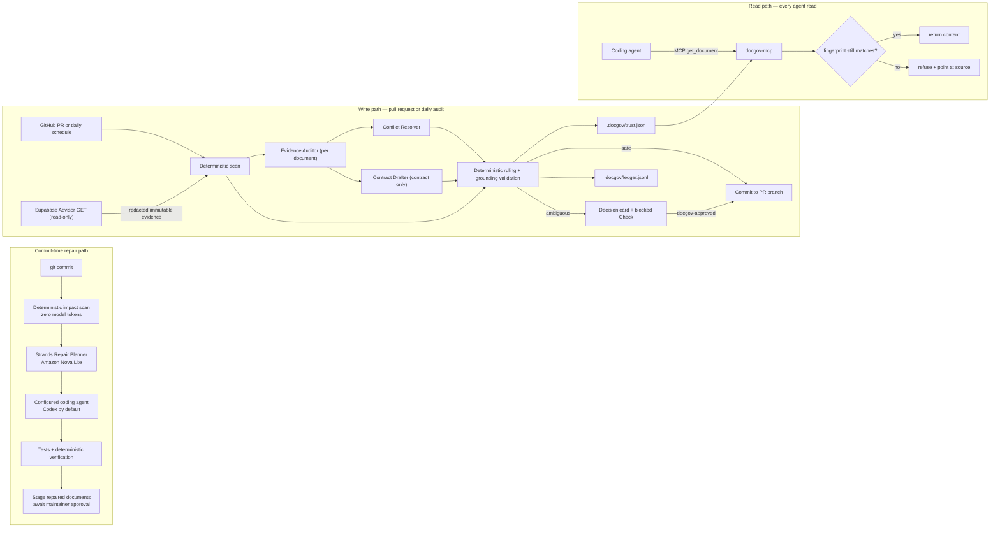

# Doc Governor

**Doc Governor is the layer that decides which documents an AI coding agent is allowed to believe.**

It stops AI-generated documentation from becoming false memory. A coding agent asks for `docs/architecture/API.md` over MCP; if the claims in that document are no longer backed by the code it describes, Doc Governor does not hand it over. It answers with the reason and the source files to read instead.

## Why it exists

A small team ships with AI coding agents. Those agents read the repository's Markdown as ground truth. When a document silently goes out of date, the agent does not notice — it confidently builds on a false statement, and nobody catches it until production. The person harmed is the engineer who trusted the output.

The fix is not "write better docs". It is to make untrustworthy documents **unreachable at the moment of reading**. A pull-request gate protects only future commits; documents already merged into `main` are already poisoned. So the enforcement point is the read, not the write.

Coding agents are also excellent at producing text and poor at maintaining a small set of authoritative documents. A repository slowly accumulates duplicate API notes, stale status pages, and dates that were changed without evidence. Doc Governor treats documentation as a governed system with five types:

| Type | Lifecycle |
| --- | --- |
| `contract` | Update the canonical document when its source dependency changes. |
| `state` | Expires after a short TTL unless a new verification evidence exists. |
| `procedure` | Requires review when commands or operational dependencies change. |
| `evidence` | Immutable, dated, and never overwritten. |
| `decision` | Superseded by a newer decision instead of silently deleted. |

The agent creates a correction commit on the pull request branch for safe changes, even when a separate high-risk finding still blocks the pull request. It blocks ambiguous, destructive, legal, public-copy, and unsupported-state changes and leaves a decision card in the pull request. A maintainer adds the `docgov-approved` label to authorize a one-time rerun for the current commit.

The model is reserved for semantic classification and ambiguity. Hashes, dependency matching, TTL checks, path boundaries, trust decisions, Supabase Advisor evidence, and ledger writes are deterministic and can run without AWS.

## The three enforcement points

```
BEFORE COMMIT                 ON THE PULL REQUEST             AT EVERY AGENT READ
─────────────                 ───────────────────             ───────────────────
Git paths + hashes            deterministic scan              MCP get_document
  │                              │                              │
  ▼                              ▼                              ▼
Strands Repair Planner        Strands governance graph        recompute dependency
(read-only, Nova Lite)        ├ Evidence Auditor              fingerprint NOW
  │                     ├ Conflict Resolver                     │
  ▼                     └ Contract Drafter                ┌─────┴─────┐
Codex edits the document               │                     MATCH       MISMATCH
  │                              ▼                       │             │
  ▼                     deterministic ruling             ▼             ▼
tests + stage repair          + trust table + ledger       return       refuse +
  │                                                    content      source pointers
  ▼
maintainer approval required
```

Trust is precomputed at pull-request time, on the daily audit, and after source reconciliation, then committed to `.docgov/trust.json`. The read path is a table lookup plus one cheap deterministic recheck — it never calls a model and never touches the network.

### Commit-triggered source reconciliation

Copy `.github/workflows/docgov-source-reconcile.yml` to reconcile generated Supabase inventory after a commit reaches `main`. It triggers only when a declared `**/supabase/config.toml` or `**/supabase/functions/**` path changes, runs the deterministic engine with the model disabled, and opens or updates one `docgov/source-reconcile` maintenance pull request when safe changes exist.

The reconciler derives Edge Function names and JWT flags from the checked-out commit's configuration and function source. Adding functions updates eligible `docgov:supabase-inventory` markers; reverting that commit derives the earlier inventory and restores the marker to match. It stages only paths in Doc Governor's `modified_paths` result, including the ledger and trust table when they change.

This reconciles source facts, not environment claims: a Git commit does not assert what is deployed to staging or production. Source/config mismatches, protected paths, missing or ambiguous markers, and ordinary Markdown prose remain blocked or stale for human review.

### Coding-agent repair before commit

Required control documents such as `AGENTS.md` and `README.md` can use the `auto_repair_documents` Catalog policy. When one of their declared dependencies changes, the tracked `.githooks/pre-commit` hook emits a bounded deterministic repair prompt by default. Set `DOCGOV_ENABLE_MODEL=1` for the competition profile: a read-only Strands Repair Planner on Amazon Bedrock then gives each affected document an isolated graph node that can read only the document itself and changed files matching its declared dependencies. The graph emits bounded instructions and cited evidence paths, never writes. An absent, malformed, out-of-scope, or `needs_human` plan blocks the commit.

`DOCGOV_REPAIR_COMMAND` sends the plan to any local coding-agent command that accepts a prompt on stdin and can edit the working tree. Codex is the default executor; Claude Code, GitHub Copilot, a local model, or another agent can be selected without changing Doc Governor. The hook then runs repository verification and stages the repaired documents. It never runs `baseline --approved`: tests prove the repository still works, not that every prose claim is true. A maintainer must review the diff and separately record the verification before MCP serves the document as trusted.

**In the competition profile, Strands on Amazon Bedrock with Amazon Nova Lite decides the evidence-bounded repair; Codex executes it; deterministic Doc Governor code and maintainer approval decide whether the result is trusted.**

```sh
git config core.hooksPath .githooks

# Optional competition profile: invoke Strands with Amazon Nova Lite on Bedrock
export AWS_REGION=us-west-2
export DOCGOV_ENABLE_MODEL=1

# Default executor: Codex
git commit -m "change implementation"

# Any other stdin-capable coding agent
DOCGOV_REPAIR_COMMAND='your-agent-command' git commit -m "change implementation"
```

The competition profile requires AWS credentials with permission to invoke Amazon Nova Lite whenever a required document is impacted. The deterministic impact scan still costs zero model tokens; Bedrock is called only after that scan finds a repair candidate and only when `DOCGOV_ENABLE_MODEL=1`. Normal local commits use the developer's existing Codex account and make no Bedrock or Claude Code call. `DOCGOV_REPAIR_PLANNER_COMMAND` exists for offline tests. Set `DOCGOV_SKIP_REPAIR=1` only for recovery; CI governance still detects an unverified required document.

**Why the recheck matters.** A developer commits code locally and `trust.json` is instantly older than `HEAD`. Without step 2 the server would serve stale content marked fresh. The recheck is pure hashing, so a document that was readable a second ago becomes unreadable the moment one of its declared dependencies changes — with no Doc Governor run in between.

## Quick start

Requirements: Python 3.12+ and a GitHub repository. AWS credentials are required only for the explicitly enabled competition profile. Strands supports Python 3.10+; the action uses Python 3.12 for a reproducible runtime. Install the `bedrock` extra to enable the PR governance graph and required-document Repair Planner.

1. Add `.docgov/catalog.yaml` to your repository. `docgov init` can generate a proposal.
2. Copy `.github/workflows/docgov-review.yml` from this repository. It checks out pull request content as data, enables write/OIDC access only for same-repository PRs, and runs fork PRs read-only. The essential action step is:

```yaml
name: Doc Governor
on:
  pull_request:
    types: [opened, synchronize, reopened, labeled]
permissions:
  contents: write
  pull-requests: write
  checks: write
jobs:
  govern:
    runs-on: ubuntu-latest
    steps:
      - uses: SophieYu04/doc-governor@v0.3.0
        with:
          mode: review
          base_sha: ${{ github.event.pull_request.base.sha }}
          head_sha: ${{ github.event.pull_request.head.sha }}
          apply: ${{ github.event.pull_request.head.repo.full_name == github.repository }}
          approved: ${{ github.event.action == 'labeled' && github.event.label.name == 'docgov-approved' }}
          enable_model: true
        env:
          GITHUB_TOKEN: ${{ secrets.GITHUB_TOKEN }}
```

`enable_model` defaults to `false`, so installing the action cannot create model charges by itself. The competition profile sets it to `true` explicitly; fork pull requests and offline runs remain deterministic-only.

3. Read the repository's exact GitHub OIDC subject prefix with `gh api repos/OWNER/REPO/actions/oidc/customization/sub --jq .sub_claim_prefix`. In `infra/aws/github-oidc-trust-policy.json`, replace `<AWS_ACCOUNT_ID>` and `<GITHUB_SUB_CLAIM_PREFIX>` with the account ID and that complete prefix. This supports both name-based and immutable owner/repository-ID subjects; do not guess the subject from the repository name.
4. Create a least-privilege AWS role with that trust policy and `infra/aws/bedrock-inference-policy.json`, replacing its account ID too. Set the role ARN as the repository variable `DOCGOV_AWS_ROLE_ARN`, then set `DOCGOV_ENABLE_MODEL=true` only on the competition repository. The Bedrock policy permits only the Amazon Nova Lite US inference profile and its three documented destination-region foundation models. The workflow exchanges GitHub OIDC for short-lived credentials only on same-repository pull requests with both variables configured; forks remain deterministic and receive no AWS identity.
5. Run `docgov init` once and review the generated Catalog proposal.

The OIDC subject lookup follows [GitHub's AWS guidance](https://docs.github.com/en/actions/how-tos/secure-your-work/security-harden-deployments/oidc-in-aws), including immutable repository subjects for newer repositories. The destination-model grants follow [Amazon Bedrock's geographic cross-Region IAM requirements](https://docs.aws.amazon.com/bedrock/latest/userguide/geographic-cross-region-inference.html). Governor responses use the current [Strands structured-output invocation](https://strandsagents.com/docs/user-guide/concepts/agents/structured-output/) and fail closed on validation or timeout errors.

Fork pull requests run in read-only mode. Never use `pull_request_target` to execute untrusted pull request code or expose repository secrets.

Each PR receives an idempotent GitHub Check and one updatable decision-card comment. A successful approved run removes `docgov-approved`; a new commit must be evaluated again.

## Connect your coding agent

`docgov-mcp` is a read-only MCP server over stdio. Point Codex, Claude Code, or Cursor at it and the agent reads documentation through the trust gate instead of off disk.

```sh
python -m pip install 'doc-governor[mcp]'
docgov review --apply          # generates .docgov/trust.json
```

```json
{
  "mcpServers": {
    "docgov": {
      "command": "docgov-mcp",
      "args": ["--root", "/absolute/path/to/your/repo"]
    }
  }
}
```

Three tools, all read-only:

| Tool | Answer |
| --- | --- |
| `get_document(path)` | The content, or a refusal that says why and names what to read instead. |
| `list_documents(type?, usable_only?)` | What exists — including documents you may **not** read, marked `usable: false` with the reason. |
| `document_status(path)` | The full trust record and whether the dependency fingerprint still matches. Never returns content. |

All three run the same recheck, so a listing can never advertise — or summarize — a document `get_document` would refuse.

A trusted read:

```json
{
  "status": "ok",
  "path": "docs/architecture/API.md",
  "content": "<full markdown>",
  "verified_at": "2026-09-06T02:10:00Z",
  "scope": "current_fact"
}
```

A refusal always carries an alternative, because a bare error just sends the agent back to the raw file:

```json
{
  "status": "refused",
  "code": "dependencies_changed",
  "path": "docs/status/RELEASE.md",
  "content": null,
  "reason": "A declared dependency of this document changed after it was verified, so its claims are unverified.",
  "read_instead": ["supabase/config.toml", "supabase/functions/health-check/index.ts"],
  "canonical_path": null,
  "how_to_resolve": "A maintainer must re-verify this document and run `docgov baseline --approved`."
}
```

`list_documents` deliberately lists unusable documents. Hiding them makes the consuming agent go read the raw file to find out what it is missing.

### MCP security properties

- The server has **no write tool, no shell tool, and no network egress**. It reads files and one JSON table.
- It rejects absolute paths, `..` segments, Windows drive letters, URL schemes, NUL bytes, non-Markdown suffixes, and symlinks that resolve outside the repository root.
- A refused document leaks **no content at all** — not the first line, not a summary, not a quoted claim in the reason string. `list_documents` summarizes only documents it would actually serve.
- Startup fails loudly when `.docgov/trust.json` is missing or declares an unknown schema version. It never falls back to serving everything.
- Content is read from disk at call time, never cached at startup, because the repository changes underneath a long-running server.

## Four constrained roles across two Strands workflows

The pre-commit Repair Planner handles the repetitive work: deciding how an affected required document should change. It runs one isolated, read-only planning node per document, cites only changed files that match the document's declared dependencies, and hands bounded instructions to the developer's configured coding agent. It never writes or approves the result.

The separate semantic governance graph uses three more roles. That graph does not exist for parallelism; it exists so that no single agent holds enough privilege to do damage.

| Agent | Sees | Tools | Structurally cannot |
| --- | --- | --- | --- |
| **Evidence Auditor** | One document's claims and its recorded evidence. Its own status line, `last_verified_at`, and every prior Doc Governor conclusion are **removed on purpose** — a document that says "verified" is trying to answer the question being asked. | `evidence_for_document`, bounded to that one document | Read any other document, read source, write anything |
| **Conflict Resolver** | Only the conflicting documents plus the Auditor verdicts. | `declared_source`, bounded to those documents' `depends_on` | Read a file no conflicting document declared, write anything |
| **Contract Drafter** | One `contract` document and the sources it declares. | `target_document`, `declared_source` | **Be constructed at all** for a `state`, `evidence`, `decision`, protected, or human-approval document |

The Drafter's restriction is enforced in code (`docgov/agents.py`), not in a prompt: `build_drafter` raises `PrivilegeError` for any non-contract document. Tool budgets are enforced in a Strands `BeforeToolCallEvent` hook that cancels the call, so an out-of-scope or over-budget call never executes — a boundary rather than an after-the-fact report.

### What happens to a proposed rewrite

The Drafter returns a proposal, never a write. Deterministic code then proves it (`docgov/drafting.py`):

1. Extract every factual token from the proposed span — identifiers, function names, endpoint paths, file paths, config keys, type names.
2. Assert each appears literally in at least one cited source file.
3. Assert the cited files are all declared in the document's `depends_on`.
4. Assert the span introduces no date, no version number, and no verification claim — none of those are recoverable from source, so writing one would be fabrication.
5. Any failure discards the draft **whole** and blocks the document instead — the file is left exactly as it was, and it becomes `usable: false` at the read path until a human deals with it.

`apply_safe_actions` re-runs the entire validation before it touches a file — including the boundary check on every cited path and the tokens the model declared itself — so a forged or stale finding cannot mutate the repository. There is no partial application: refusing fails safe, and auto-rewriting incorrectly fails dangerous.

## CLI

```sh
python -m venv .venv
source .venv/bin/activate
python -m pip install -e '.[dev]'

docgov init
docgov review --base BASE_SHA --head HEAD_SHA
docgov audit
SUPABASE_ACCESS_TOKEN=... docgov audit --apply \
  --supabase-projects 'staging=PROJECT_REF,production=PROJECT_REF'
docgov verify
docgov verify --strict docs/architecture/API.md
docgov drift --environments staging,production
docgov-mcp --root .
```

The default CLI mode is deterministic and offline. Strict verification is read-only and exits with status `2` when a requested tracked Markdown file is stale, expired, unregistered, changed after verification, or has a changed dependency fingerprint. It reports one of four trust scopes: `current_fact`, `rationale_only`, `historical_evidence`, or `untrusted`.

For a repository's first reviewed Catalog only, record the maintainer-approved hashes without changing documentation dates:

```sh
docgov baseline --approved
docgov verify --strict
```

The baseline command writes only `.docgov/ledger.jsonl`. PR review accepts a matching verification record when both the document hash and its dependency fingerprint match the checked-out head; it does not immediately mark that document stale again. Documents already quarantined as `stale` stay unreadable through strict verification without creating repeat PR noise. Future source changes invalidate the matching document until it is updated and verified again. Set `DOCGOV_ENABLE_MODEL=1`, pass `--enable-model`, and install `.[bedrock]` only when semantic classification and duplicate reasoning are needed.

A model-enabled decision includes a privacy-safe `model_trace` containing only agent, tool, and model identifiers, never document text or reasoning. Each agent's tool budget is enforced before the call by a Strands hook, and any schema violation, timeout, or privilege error fails the whole run closed with the deterministic findings intact.

A model-only finding cannot update content or mark a document stale. Exactly two model-influenced actions survive into the repository, and both are re-proved by deterministic code first: an exact or additive new-file duplicate merge, and a contract span whose every factual token is grounded in a cited source file. Every other model-only finding requires a human decision.

### Read-only Supabase Advisor evidence

Audit mode can fetch the Security and Performance Advisor through Supabase Management API `GET` endpoints. Use a fine-grained token with only `advisors_read`, store it as `SUPABASE_ACCESS_TOKEN`, and pass named project refs through `--supabase-projects`.

The collector writes an immutable JSON snapshot only when an environment's Advisor fingerprint changes. Snapshots contain counts, lint names, and one-way hashes; entity names, metadata, cache keys, descriptions, details, project refs, and raw responses are not stored. Fetching every configured environment must succeed before any evidence file is written.

Register the evidence directory as an `evidence` taxonomy path and add it to each affected document's `depends_on` list:

```yaml
taxonomy:
  evidence:
    - docs/security-evidence/**

documents:
  - path: docs/status/RELEASE.md
    type: state
    depends_on:
      - docs/security-evidence/supabase-advisors/**
```

When a new snapshot appears, the same audit treats it as source evidence and marks dependent State, Contract, or Procedure documents stale. A maintenance pull request then contains the immutable snapshot, Catalog status change, and append-only ledger record. Unchanged Advisor results create no commit or pull-request noise.

### Cross-environment drift (read-only)

The documented release flow is `staging → git commit / migration → release branch → production deployment`. That flow is only trustworthy if production actually reflects what Git says. If someone changed production from the Supabase dashboard, every document describing production now describes a state that no commit produced.

```sh
# Compare the newest committed Advisor evidence per environment. No network, no token.
docgov drift --environments staging,production

# Fetch fresh read-only evidence first, then compare and record the verdict.
SUPABASE_ACCESS_TOKEN=... docgov drift --collect --apply \
  --supabase-projects 'staging=PROJECT_REF,production=PROJECT_REF'

# The release flow records the state it promoted, which rule 1 compares against.
docgov drift --apply --record-promotion production
```

An `environment_drift` finding is raised when either holds:

1. Production's Advisor fingerprint differs from the one recorded when the last release was promoted to production, and no later promotion explains it — someone changed production outside the release flow.
2. Production reports Advisor signals (categories or lint types) that staging does not — the environments have diverged, so staging verification no longer predicts production.

The finding is `high` risk and `block`. It blocks a *release-readiness verdict*, never a deployment: Doc Governor emits the finding and the release workflow decides what to do with it. It holds no production write credential of any kind and requires only `advisors_read`. Fork pull requests never run it and never receive the token.

**The connection back to the read path:** while drift is unresolved, every `state` and `procedure` document that declares the drifted environment becomes `usable: false` in `trust.json`, and the MCP server refuses it. If production is not at a known Git state, no document describing production is trustworthy.

Declare the dependency explicitly on the catalog record:

```yaml
documents:
  - path: docs/status/PRODUCTION.md
    type: state
    environments: [production]
```

An environment name appearing as a path segment in `depends_on` counts too.

**Honest limitation.** Advisor output is a lint result set, not a complete configuration snapshot. This detects *symptomatic* drift — divergence visible to the Advisor — not every possible configuration change. A silent change that produces no Advisor difference is invisible to it. Rule 2 compares which signals are present, so a change in the *number* of findings staging already reports is caught by rule 1's fingerprint (which includes counts) and not by rule 2. Closing the remaining gap needs a full configuration diff through the Management API, which is future work and is not claimed here.

When neither rule can be evaluated — no recorded promotion *and* no reference-environment evidence — Doc Governor emits the drift finding anyway. An environment nobody checked is not an environment that passed.

Repositories with a separate canonical documentation branch can check its tree without switching branches:

```sh
docgov verify --strict --ref codex/appstore-release docs/architecture/API.md
```

The strict scan considers only Git-tracked Markdown. Generated output, dependency checkouts, and other untracked notes never become documentation authority accidentally. New untracked source files that match a declared dependency still invalidate the corresponding document immediately.

## Repository layout

- `.docgov/catalog.yaml`: central document types, dependencies, owners, TTLs, and protected paths.
- `.docgov/ledger.jsonl`: append-only verification and mutation ledger.
- `.docgov/trust.json`: the committed, deterministic trust table the MCP server reads.
- `docgov/trust_state.py`: builds that table. `docgov/mcp_server.py`: serves it.
- `docgov/repair_agents.py`: the read-only Strands Repair Planner. `docgov/agents.py`: the three-agent semantic governance graph. `docgov/drafting.py`: grounding validation for proposed prose.
- `docgov/`: the CLI, deterministic governance engine, GitHub reporter, and Supabase adapter.
- `examples/supabase-demo/`: a small fixture that demonstrates Edge Function and status-document drift.
- `.github/workflows/`: pull request, daily audit, and initial Catalog proposal workflows.

Supabase Markdown may include a machine-readable marker such as `<!-- docgov:supabase-inventory {"functions":["health-check"]} -->`; the source adapter exposes these markers to the verifier and Governor without treating them as a second source of truth. The remote adapter is separate and read-only: it records sanitized Advisor state but never executes SQL, deploys functions, or changes a Supabase project.

## Architecture



## Demo

Run the complete deterministic scenario locally:

```sh
python scripts/demo.py
```

The fixture simulates a coding agent adding an Edge Function, creating a duplicate API document, refreshing a State date without evidence, and changing protected public copy. Doc Governor synchronizes the source-backed API and Edge inventory, removes the duplicate, preserves the protected file, and returns `action_required` for the two human decisions.

It then does the part that matters — it goes on to read through the supply layer:

1. `get_document("docs/architecture/API.md")` returns the corrected contract.
2. `get_document("docs/status/RELEASE.md")` is refused: no evidence backs its verification claim.
3. `get_document("docs/architecture/API-notes.md")` is refused, but names the canonical document that absorbed it.
4. **A dependency file is touched and the same trusted document is immediately refused — with no Doc Governor run in between.** The fingerprint recheck caught it.
5. Production drifts from the state Git produced. `docgov drift` raises `environment_drift`, and `docs/status/PRODUCTION.md` flips from readable to refused as a consequence.

Step 4 is the whole argument in one move: nothing re-ran, and the answer still changed.

Use `--keep` to inspect the temporary repository, and `--mcp-stdio` (with the `mcp` extra installed) to drive the real `docgov-mcp` stdio server the way a coding agent would.

After configuring AWS credentials with Bedrock access, run the identical scenario through the real Strands agent graph:

```sh
python scripts/demo.py --enable-model --keep
```

The JSON output proves `model_used: true` and shows the redacted per-agent tool trace. The deterministic run remains the zero-credential path for judges and contributors.

## Development and tests

```sh
python -m pytest -q
python scripts/demo.py
python -m docgov --json verify
```

The test suite uses temporary repositories and needs no AWS credentials. `tests/test_strands_graph.py` drives the **real** `GraphBuilder`, the real agent nodes, the real `@tool` closures, the real `BeforeToolCallEvent` hook and the real edge conditions, replacing only the Bedrock network call with a `Model` that yields canned stream events — so a Strands API change fails in CI rather than the first time the action points at Bedrock. It does not prove that a live model returns a schema-valid answer; nothing short of a real Bedrock call does. `tests/test_mcp_server.py` exercises the read path directly, including path traversal, symlink escape, content-leak, and fail-closed cases; `tests/test_trust_state.py` covers the determinism of the committed trust table.

### Security invariants

1. The MCP server has no write tool, no shell tool, and no network egress.
2. It rejects absolute paths, `..` segments, and symlinks that escape the repository root.
3. Refused documents leak no content, including in reason strings and log lines.
4. Fork pull requests remain read-only and receive no AWS identity. `pull_request_target` is never used.
5. No agent has both model access and infrastructure write access.
6. Model failure, timeout, and schema-validation failure fail closed.
7. `model_trace` contains identifiers only, never document text.

## Disclosure

This project was created as a new hackathon project. Its problem statement was informed by maintaining a separate mobile application repository, but no private source code, credentials, production data, or deployment artifact is included here. Any generic inventory ideas adapted from prior work are reimplemented and tested in this repository.

## License

Apache-2.0. See [LICENSE](LICENSE).
